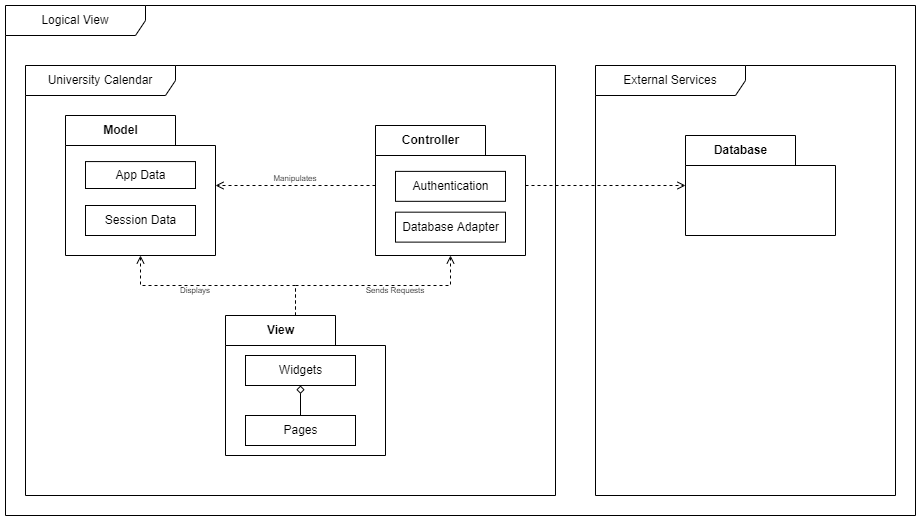
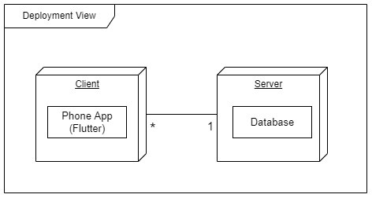

## Architecture and Design

### Logical architecture

  

- The project is organized using the Model-View-Controller Pattern (MVC). 
  - The **Model** is responsible to hold all the data of the application that will be displayed by the view and manipulated by the controller.
  - The **View** consists of Pages that are made of Widgets. It displays data and takes inputs from the user.
  - The **Controller** contains all the business logic that includes the connection to the database and the authentication.

### Physical architecture

  

- We will be using the Flutter framework for the mobile application and for the Server we are thinking about the possibility of using Firebase.

### Vertical prototype

At this phase, instead of a complete user story, you can simply implement a feature that demonstrates thay you can use the technology, for example, show a screen with the app credits (name and authors).

  

