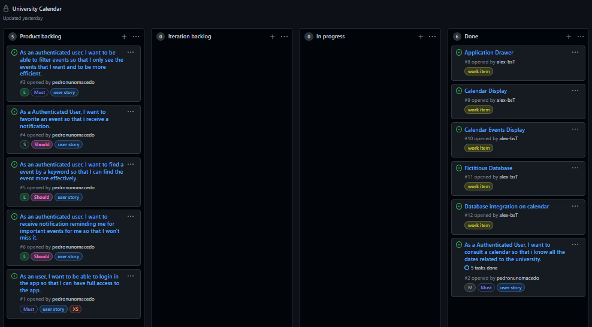
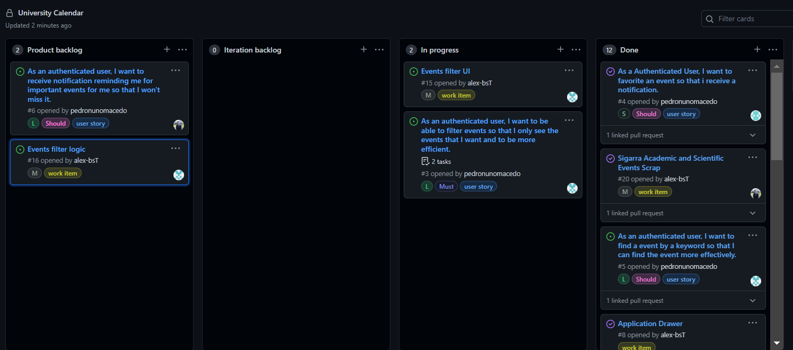
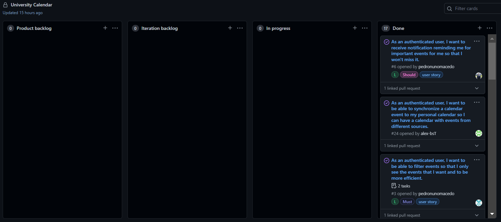

## Project Management

You can find below information and references related with the project management in our team: 

* Backlog management: Product backlog and Iteration backlog in a [Github Projects board](https://github.com/LEIC-ES-2021-22/2LEIC06T2/projects/1);
* Release management: 
  * [iteration 0](https://github.com/LEIC-ES-2021-22/2LEIC06T2/releases/tag/iteration0)
  * [iteration 1](https://github.com/LEIC-ES-2021-22/2LEIC06T2/releases/tag/iteration1)
  * [iteration 2](https://github.com/LEIC-ES-2021-22/2LEIC06T2/releases/tag/iteration2)
  * [iteration 3](https://github.com/LEIC-ES-2021-22/2LEIC06T2/releases/tag/iteration3)
* Iteration planning and retrospectives: 

### Iteration 1

Final Board:

  

### Iteration 2

Final Board:

  

### Iteration 3

Final Board:

  

[Iteration 1 Retrospectives](notes_it1.md)

