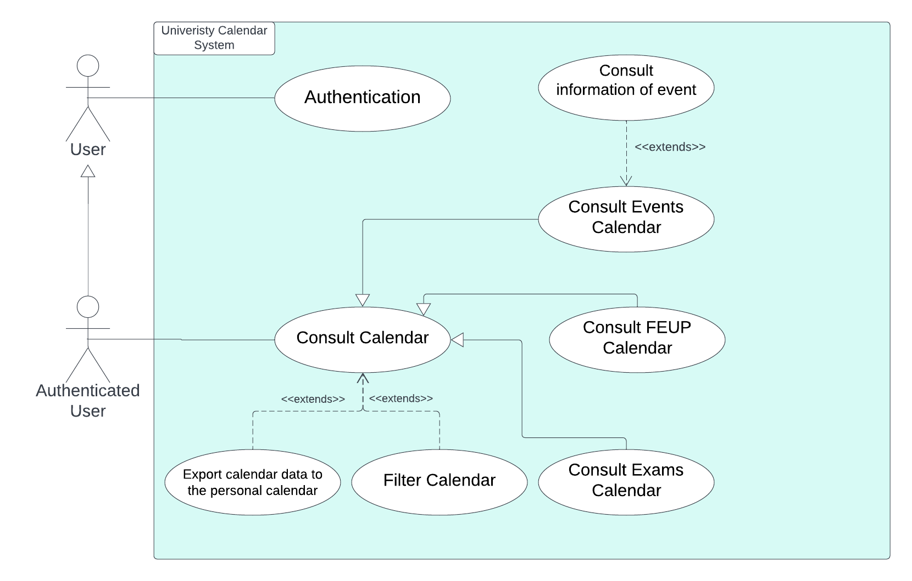
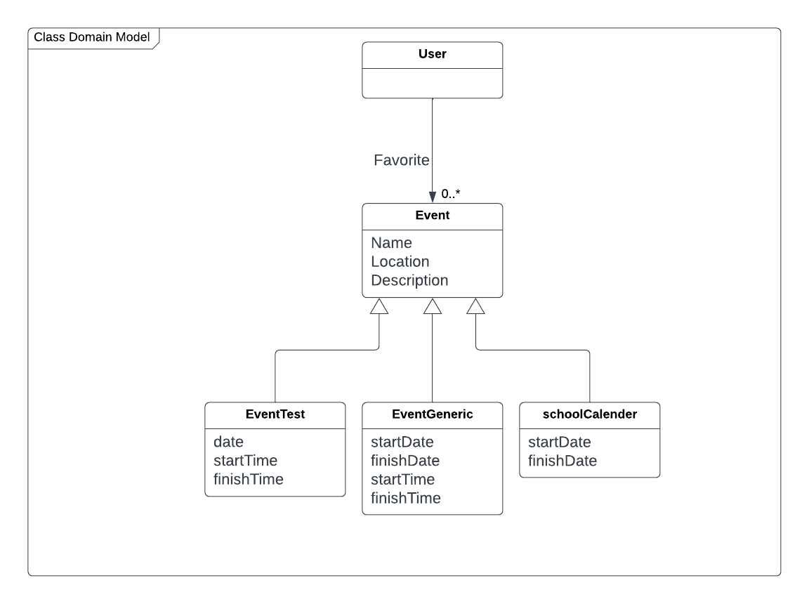

## Requirements

### Use case model 

 

  

|||
| --- | --- |
| *Name* | Authenticate |
| *Actor* |  User | 
| *Description* | The user authenticates to have access to the features. |
| *Preconditions* | - The user must belong to the UP community. |
| *Postconditions* | - The user becomes an authenticated user. |
| *Normal flow* | 1. The user accesses the application by mobile phone.  2. The system asks for authentication.  3. The user enters his data.  4. The user is now authenticated and has access to all features. |
| *Alternative flows and exceptions* | 1. [Authentication failure] If, in step 3 of the normal flow the authentication fails, the system gives the user the possibility to retry. |

 

|||
| --- | --- |
| *Name* | Consult Calendar |
| *Actor* |  Authenticated User | 
| *Description* | The user has access to the various calendars. |
| *Preconditions* | - The system must have information to display the calendars. (events/exams) |
| *Postconditions* | --- |
| *Normal flow* | 1. The authenticated user accesses the calendar consultation.  2. The system shows the calendar with all the dates (events, exams, important FEUP dates) |
| *Alternative flows and exceptions* | 1. [Filter Calendar] The user can filter the calendar. 2. [Sync with personal calendar] The user can sync the displayed calendar with his personal calendar. 3. [Consult Event Details] If the user selects an event, he will be able to see more details. |

### Domain model

                                      
